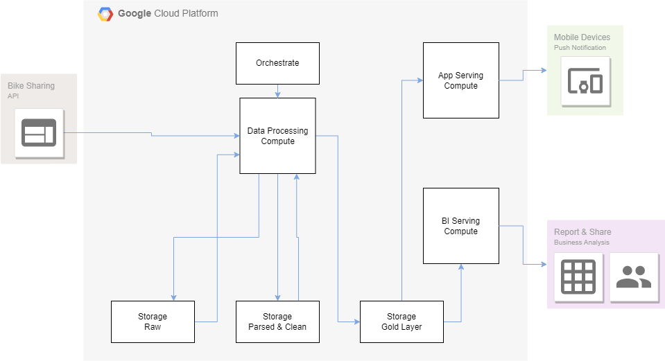

# Data Pipelines rookie mistakes

## Quick background

A few years ago, as I was trying to get hands-on exposure to cloud technologies, I decided to develop a data pipeline on the google cloud platform. Rather than trying numerous sanitized tutorials, I picked up a project that would be useful for me and see how I would implement it end to end.
The bike sharing company in Paris had changed owners and bikes became scarce around my neighborhood. I wanted to monitor, understand and potentially predict if I could find a bike or not in the morning when I left for work.

## My first pipeline few years ago on GCP

The needs were simple but I needed some solid foundations on which I could add on features. I also needed something that could run over a few years to gather statistics and at low cost since it was a side project that I would pay for myself.

The blocks of my architecture are pretty standard for any analytics platform:

- Ingest (Batch or Streaming)
- Parse and clean
- Enrich (rule based or ML)
- Serve to end user (BI or WebApp)

Across that pipeline you would add security, orchestration and governance. I can summarize it on the block diagram below.

In my case, I tried to keep it simple. In terms of security and governance, I used the GCP encryption and since I was the only user, I had no further security or governance. I had full access to all resources.

Now: how have I implemented it? I had a few constraints as mentioned above. I needed long running and as cheap as possible while testing the technologies that the cloud had to offer. I decided to go with GCP as this was the platform we were using at work at the time. I summarized my thought process in the table below and the result in the diagram below.

|Pipeline Block |What I wanted to achieve | My choices |
| ---- | ---- | ---- |
|Ingestion | Ingest data from and API call to the bike sharing company’s open data platform | **Language** : Python. SQL would have been more complicated. I did not master Java or Scala   **Compute**: i could run a VM or use serverless compute or include the API as part of a data processing pipeline **Storage**: Could be cloud storage, database or streaming queue. I chose cloud storage to have a trace of all the API call. I used a datastore (serverless and within the free tier) to collect the station metadata (name, location, …) **Orchestration**: airflow would have been too expensive, workflow did not exist. I went with cloud scheduler for all my scheduling |
| Clean, Parse,  Enrich | Process the raw data to join bike station status with the station metadata, flatten the schema and append to the global table | **Language** : still used Python for consistency **Compute**: Went for Dataflow for data processing so that I can test scalability and use the capacity to run processing on preemptible instances. I still needed to rely on Cloud Functions for kicking off the jobs **Storage** : I duplicated the data in cloud storage to be able to run ML and access data without paying Big Query and I saved data in Big Query too to be able to plug in visualization tool like Power BI or Data Studio. **Orchestration** : Still cloud scheduler. For enriching the data with ML, I used my own laptop with Docker as I found the AI platform not so practical and costly to run exploratory analysis: I downloaded part of the data on my laptop. |
|Serving | Serve the data for the end users. This was done with a dashboard but also wanted to have a webApp to consult the output of the ML prediction on the go. | **Language**: Still Python **Compute**: used Big Query as the warehouse for adhoc queries and for the underlying dashboard. For the webAPI I used Cloud Run for its ability to scale down to zero and a Redis Database for holding the latest time series for the bike station (with Redis free tier).|
 
I had several cron schedulers, several cloud functions and a dataflow pipeline

## How would I do it today

Recently , as the cost of the setup started to creep-up, I decided to see if there was a more modern and simple way to do it. Bonus points would be if I could deploy on different clouds if necessary. As I am familiar with Databricks, I did the exercise. I could have my storage in open source decoupled from the computer, I would have governance and orchestration for free. And I could also run my ML directly on the data in the cloud while benefiting from the MLOps part for free.
The architecture looks like below and the code is available on github here. As for the API I hesitated between Cloud Functions and a tiny VM.

I used Databricks Auto Loader to ingest files. This process automates file discovery, ingesting only the newly arrived files. Moving from Parquet to Delta as a table format brought performance and automation. The automatic metadata construction with Delta adds indexes that bring query performance without relying solely on partition. Databricks runtime automated compaction and kept natural sort order which is perfect for this time series. Finally, Delta Live Table facilitated orchestration by allowing the addition of quality criteria, merge patterns, lineage and cluster management with autoscaling for example.

The pipeline ingests data incrementally and we can run it as batch or streaming, on regular or preemptible instances to reduce cost. We can selectively refresh tables and the autoscaling facilitates cluster management as well as cost.

Finally, thanks to the LakeHouse architecture, the tables are stored and structured on google storage with the catalog being available on the databricks metastore. From there we can share it with simple `GRANT SELECT` and add on with ML and BI all from storage location based on an open format.

We can actually connect to PowerBI and use the forecasted value to get more insight

## Lessons learnt

Off course developing on a platform made for Data and AI workflows gave a coherent experience from data ingestion to serving. I did not feel I had to jump between many different services and stitch them to achieve my end goal. 
There is a lot that goes behind the scenes on the platform to optimize the pipeline. With Dataflow I had a huge number of small files which made querying, file transfer very inefficient. Databricks is auto-compacting those files automatically making for cost effective storage and performant queries. 
It was extremely simple with autoML and MLFlow experiments to try, experiment with different models for forecasting bikes availability without having to manually track all the trials and by easily adding the prediction to the final table so that it’s available for BI or the WebApp. I felt I developed my pipeline much quicker than a few years ago. Part is due to my experience growing, part is definitely due to the ease of working on an integrated platform.

## Next steps

We could add some pipeline monitoring using the pipeline system tables from the delta live table. We could add some weather API to get more precision on our forecast. We could push some of the data to Big Query (if we cannot wait for Big Query capability, in 2023, to query Delta Tables directly) and of course we should automate it with some CI/CD.

